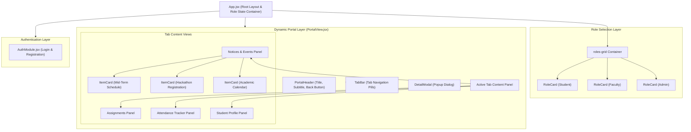

# EXPERIMENT 5: Building Modular Frontend Applications Using a Component-Based Approach (React)

**Course:** CS3301 - Full Stack Development  
**Institution:** RV University — School of Computer Science & Engineering  
**Student Author:** Dhruvi Mittal  
**Academic Year:** 2026–2027 (Semester V)  

---

## 1. Aim
To build a modular frontend application using React, applying a component-based approach with state and event handling.

---

## 2. Learning Outcomes
After completing this experiment, the student will be able to:
1. **Explain why component-based architecture is useful** for building complex web interfaces.
2. **Create and reuse React components** across different parts of an application.
3. **Pass data into child components using props** to dynamically render content.
4. **Manage changing data inside components using state** (`useState` hook).
5. **Handle user events** (button clicks, tab switches, modal toggles) within a React application.
6. **Observe declarative rendering** where interface updates automatically follow state modifications.

---

## 3. Prerequisites
Before attempting this experiment, the student should be familiar with:
- Solid understanding of JavaScript (ES6+), DOM concepts, and functions from Experiments 3 and 4.
- A React application initialized with a modern build tool such as **Vite**.
- Understanding of application state and event-driven interaction patterns from Experiment 4.

---

## 4. Theoretical Background

### 4.1 Component-Based Architecture
A **component** is a self-contained, independent, reusable unit of user interface (e.g., a card, a navigation bar, a modal dialog, or a button). Rather than authoring a massive, monolithic HTML file, component-based architecture composes an application from specialized, decoupled components. This separation provides:
- **Maintainability:** Isolated components can be updated without unintended side-effects on distant parts of the layout.
- **Reusability:** A single component (e.g., `ItemCard` or `RoleCard`) can be instantiated multiple times with distinct datasets.
- **Testability:** Individual UI units and their associated business logic can be unit-tested in isolation.

### 4.2 JSX (JavaScript XML)
React leverages **JSX**, a syntax extension to JavaScript that allows developers to describe UI structures in an HTML-like format directly within JavaScript functions. JSX combines UI markup with rendering logic:
```jsx
function NoticeBadge({ type, text }) {
  return <span className={`badge badge-${type}`}>{text}</span>;
}
```

### 4.3 Props vs. State

| Property | Props (Properties) | State |
| :--- | :--- | :--- |
| **Origin** | Passed downwards from parent component | Initialized and owned inside the component |
| **Mutability** | **Immutable** (read-only for child component) | **Mutable** via its setter function (`setState`) |
| **Purpose** | Parameterizes child components with dynamic data | Holds interactive data that changes over time |
| **Re-render** | Changing props triggers child re-render | Calling setter triggers component re-render |

### 4.4 Declarative vs. Imperative UI
In traditional imperative JavaScript (DOM manipulation), developers explicitly query elements and execute DOM updates:
```javascript
// Imperative (manual DOM mutation)
document.getElementById('status').innerText = 'Submitted';
```
In React's **declarative paradigm**, developers specify *what* the interface should look like for a given state:
```jsx
// Declarative (UI is a function of state)
<span className={isSubmitted ? "status-done" : "status-pending"}>
  {isSubmitted ? "Submitted ✓" : "Pending"}
</span>
```
When state changes via `setIsSubmitted(true)`, React computes the difference (Virtual DOM diffing) and efficiently updates the real DOM.

---

## 5. Problem Statement
Build a modular React application for the **Campus Connect Portal**. Break the interface into several reusable components and compose them together. Pass data into child components using props so the same component can display different content. Use state to manage at least one piece of information that changes in response to the user, and handle user events (such as clicks or form input) to update that state. When the state changes, the interface should update automatically.

---

## 6. Component Hierarchy & Architecture



---

## 7. Component Specifications

| Component | Props Received | State Managed | Description |
| :--- | :--- | :--- | :--- |
| **`RoleCard.jsx`** | `title`, `icon`, `features`, `borderClass`, `bgBtnClass`, `btnText`, `onSelect`, `isActive` | None (pure presentation) | Reusable role card displaying capabilities and access trigger. |
| **`PortalHeader.jsx`** | `title`, `icon`, `subtitle`, `onBack` | None | Slate top header bar with branding and `← Back to Main Campus View` button. |
| **`TabBar.jsx`** | `tabs`, `activeTab`, `onTabChange` | None | Navigation bar that renders tabs dynamically and delegates clicks upwards. |
| **`ItemCard.jsx`** | `title`, `meta`, `badge`, `badgeType`, `actionText`, `onAction`, `children` | Hover / interactive | Reusable card rendering notice rows, assignments, or attendance metrics. |
| **`DetailModal.jsx`** | `isOpen`, `item`, `onClose` | None | Accessible modal popup displaying full circular text and attachment links. |
| **`PortalView.jsx`** | `role`, `onBack` | `activeTab`, `selectedItem`, `assignments`, `attendance`, `profileStatus` | Parent container orchestrating tab views, event handlers, and data mutators. |
| **`App.jsx`** | None | `activeRole` | Root application orchestrating role cards, active portal rendering, and auth. |

---

## 8. Algorithm & Step-by-Step Implementation

1. **Initialize Application Environment:**
   Set up Vite React project structure (`client/src/`).
2. **Decompose UI into Modular Components:**
   Identify recurring layout patterns: role cards, headers, tabs, item rows, and modals.
3. **Build Parent Layout Component (`App.jsx`):**
   Initialize top-level state `activeRole = 'student'` to control which portal view is rendered.
4. **Create Child Component 1 (`RoleCard.jsx`):**
   Accept `title`, `icon`, `features`, and `onSelect` props. Instantiate three instances in `roles-grid` for Student, Faculty, and Admin.
5. **Create Child Component 2 (`PortalHeader.jsx`):**
   Render header bar with title, subtitle, and `← Back to Main Campus View` trigger which invokes `onBack()`.
6. **Create Child Component 3 (`TabBar.jsx`):**
   Map `tabs` array into button elements. Highlight active tab with CSS class `.active` based on `activeTab` prop.
7. **Create Child Component 4 (`ItemCard.jsx`):**
   Render item title, metadata (`SOCSE • Sept 10, 2026`), badge, and `[View Details]` action button.
8. **Implement State in Parent (`PortalView.jsx`):**
   - `activeTab`: tracks currently displayed tab (`notices`, `assignments`, `attendance`, `profile`).
   - `selectedItem`: tracks which notice is opened inside `DetailModal`.
   - `assignments`: array of assignment objects with toggleable `status` (`pending` / `submitted`).
   - `attendance`: array of course attendance counters (`attended` / `total`).
9. **Attach Event Handlers:**
   - Tab click: `onTabChange(tabId)` -> updates `activeTab`.
   - View details click: `onAction={() => setSelectedItem(notice)}` -> triggers modal.
   - Assignment submit: `handleToggleAssignment(id)` -> mutates status.
   - Attendance check-in: `handleMarkAttendance(id)` -> increments attended sessions and recalculates progress bar percentage.
   - Back click: `onBack()` -> resets `activeRole = null`.
10. **Verify Automatic Re-rendering:**
    Confirm DOM efficiently updates when toggling assignment submission or marking attendance.
11. **Browser Testing & Validation:**
    Verify console is clean and responsive styles work across mobile and desktop viewports.

---

## 9. Code Implementation Highlights

### 9.1 Passing Data via Props (`RoleCard.jsx`)
```jsx
export default function RoleCard({
  title,
  icon,
  features = [],
  borderClass = 'student-border',
  bgBtnClass = 'student-bg',
  btnText = 'Access View',
  onSelect,
  isActive = false
}) {
  return (
    <article className={`role-card ${borderClass}`}>
      <div className="role-icon">{icon}</div>
      <h3>{title}</h3>
      <ul className="feature-bullets">
        {features.map((feature, idx) => (
          <li key={idx}>{feature}</li>
        ))}
      </ul>
      <button type="button" className={`btn-portal ${bgBtnClass}`} onClick={onSelect}>
        {isActive ? `✓ Active (${title})` : btnText}
      </button>
    </article>
  );
}
```

### 9.2 Managing State & Events (`PortalView.jsx`)
```jsx
// Tab state management
const [activeTab, setActiveTab] = useState('notices');

// Modal popup state
const [selectedItem, setSelectedItem] = useState(null);

// Interactive assignment state mutation
const handleToggleAssignment = (id) => {
  setAssignments((prev) =>
    prev.map((item) =>
      item.id === id
        ? { ...item, status: item.status === 'submitted' ? 'pending' : 'submitted' }
        : item
    )
  );
};
```

---

## 10. Verification & Test Results

| Test Case | User Interaction | Expected Output | Status |
| :--- | :--- | :--- | :--- |
| **TC-01** | Click "Access Student View" | `Student Portal` container renders below cards with `🎓 Student Portal` header | **PASS** |
| **TC-02** | Default View in Student Portal | `Notices & Events` tab is active; displays "Mid-Term Exam Schedule Released" and "Hackathon Registration Open" | **PASS** |
| **TC-03** | Click "View Details" | `DetailModal` opens showing comprehensive circular details | **PASS** |
| **TC-04** | Click Modal "Close" / Background | Modal closes cleanly | **PASS** |
| **TC-05** | Switch Tab to "Assignments" | Assignments list renders; clicking "Submit Assignment" flips state to "Submitted ✓" and updates button style | **PASS** |
| **TC-06** | Switch Tab to "Track Attendance" | Attendance percentages render; clicking "+ Check In" increments count and expands progress bar | **PASS** |
| **TC-07** | Click "← Back to Main Campus View" | Portal container unmounts and closes cleanly | **PASS** |
| **TC-08** | Click "Access Faculty View" / "Admin View" | Role card updates; corresponding role portal and specialized tabs render | **PASS** |
| **TC-09** | Production Build | `npm run build` completes with 0 errors | **PASS** |

### 10.1 Real-Time Step-by-Step Screenshots (Saved Locally in `/screenshots`)

The real-time step-by-step test screenshots are saved locally in the `screenshots/` folder on the local machine for lab reports, printouts, and digital submissions:

| Step # | Demonstrated Feature | Local File Path |
| :---: | :--- | :--- |
| **Step 1** | Role Selection Grid (`RoleCard` Components & Props) | `screenshots/01_role_views_overview.png` |
| **Step 2** | Student Portal Overview & Notices Tab (Classroom Demo) | `screenshots/02_student_portal_notices.png` |
| **Step 3** | Interactive Notice Details Modal (`DetailModal` & State) | `screenshots/03_notice_detail_modal.png` |
| **Step 4** | Enrolled Course Assignments Tab | `screenshots/04_assignments_tab.png` |
| **Step 5** | Assignment State Mutation (Pending ⟷ Submitted) | `screenshots/05_assignment_submitted_state.png` |
| **Step 6** | Real-Time Attendance Tracker with Progress Bar | `screenshots/06_track_attendance_tab.png` |
| **Step 7** | Dynamic Attendance Increment (`+ Check In` Action) | `screenshots/07_attendance_incremented.png` |
| **Step 8** | Student Academic Profile Overview | `screenshots/08_student_profile_tab.png` |
| **Step 9** | Component Reusability across Roles (Faculty View) | `screenshots/09_faculty_portal_view.png` |

---

## 11. Conclusion
In this experiment, a modular frontend application was successfully designed and built using React. The system demonstrates:
- Clean decomposition of complex interfaces into reusable components (`RoleCard`, `PortalHeader`, `TabBar`, `ItemCard`, `DetailModal`).
- Clear separation between static configuration (passed via **props**) and dynamic behavior (managed via **state** and **event listeners**).
- Automatic re-rendering in response to state transitions without manual DOM manipulation.
