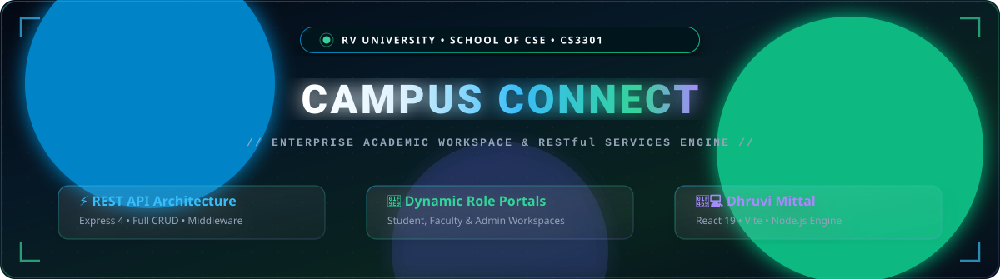
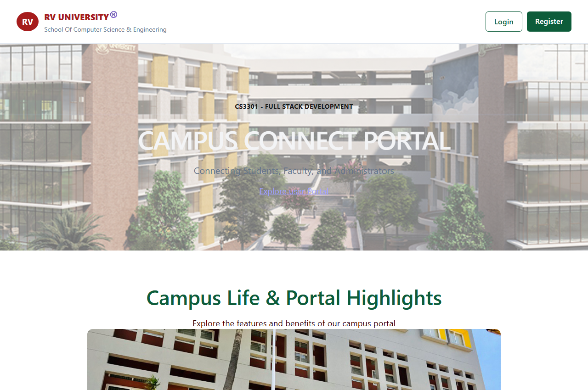
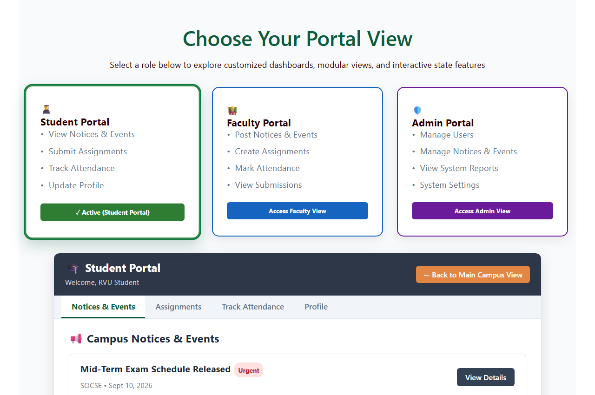
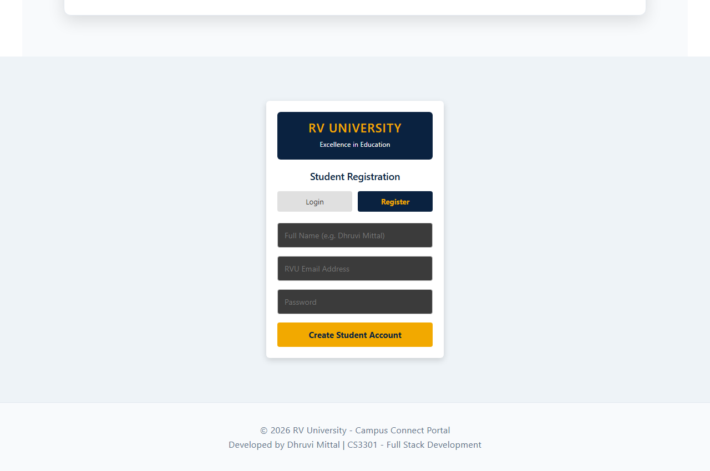
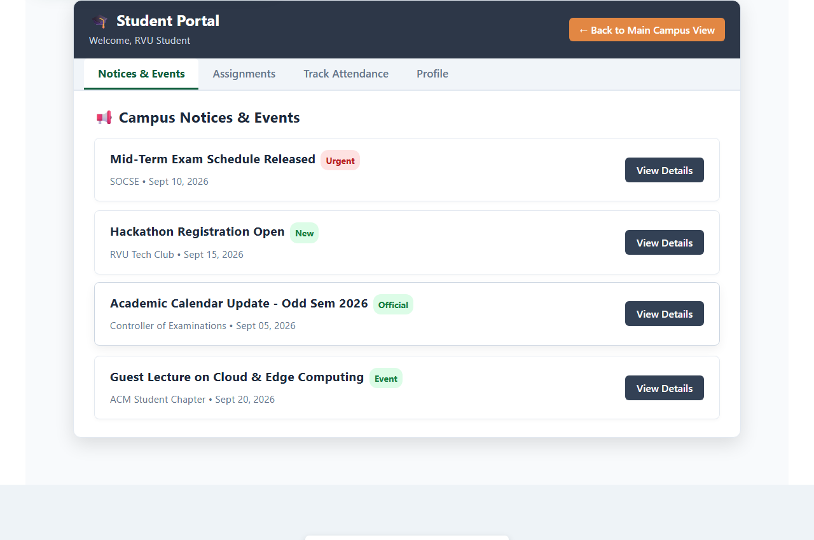
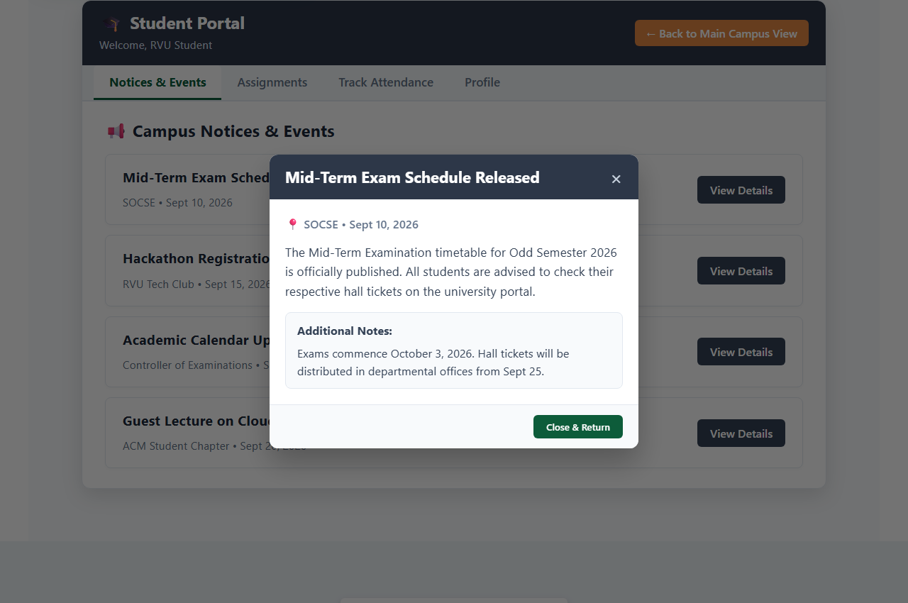
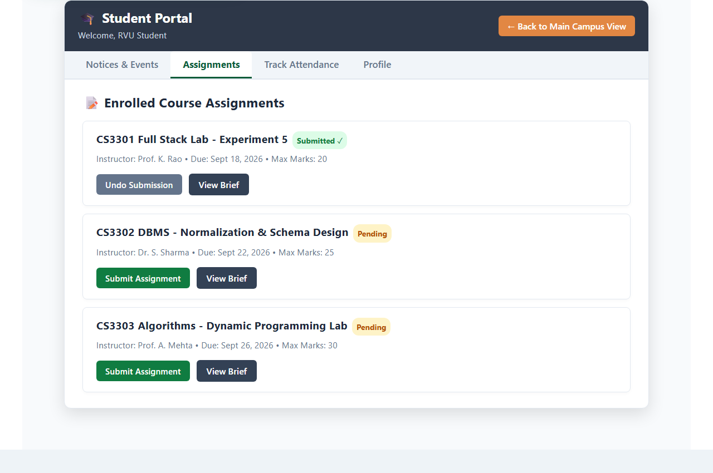
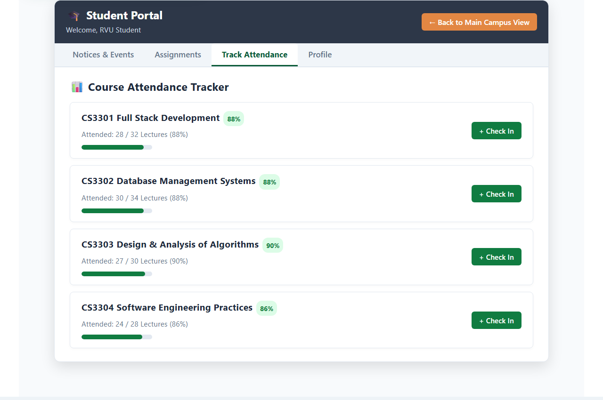
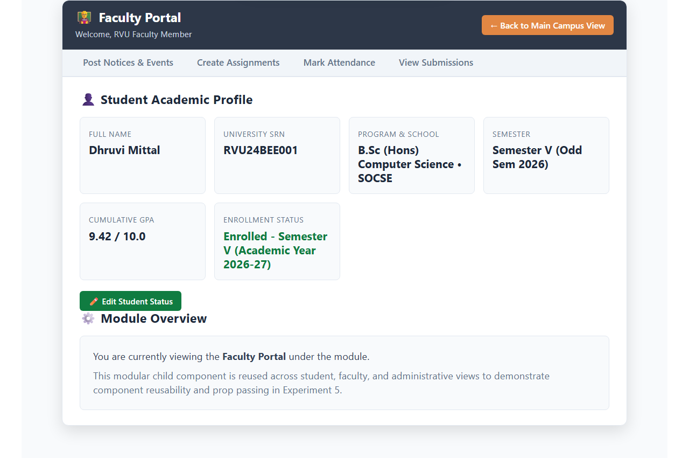
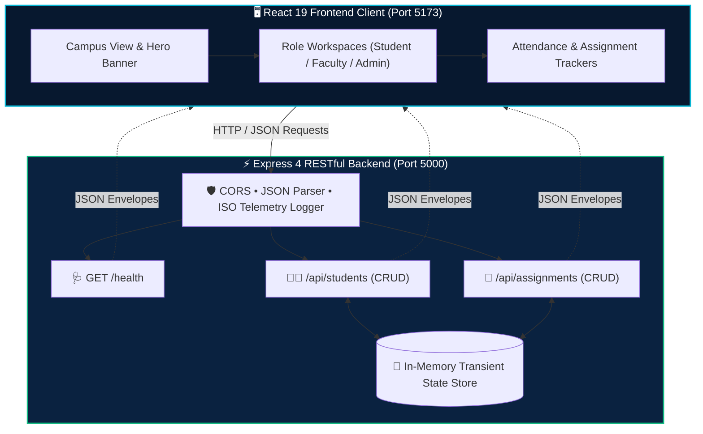

<div align="center">

<!-- Local SVG Animated Institutional Showcase Banner -->


<p align="center">
  
</p>

<p align="center">
  <a href="https://github.com/Dhruvi-tech/Campus-Connect-Portal"></a>
  <a href="https://github.com/Dhruvi-tech"></a>
  <a href="https://rvu.edu.in"></a>
  <a href="https://react.dev/"></a>
  <a href="https://expressjs.com/"></a>
  <a href="https://nodejs.org/"></a>
</p>

<!-- Navigation Bar -->
<p align="center">
  <a href="#-live-portal-showcase"><b>Showcase</b></a> &nbsp;•&nbsp;
  <a href="#-role-workspaces--visual-walkthrough"><b>Workspaces</b></a> &nbsp;•&nbsp;
  <a href="#-system-architecture"><b>Architecture</b></a> &nbsp;•&nbsp;
  <a href="#-rest-api-endpoints"><b>REST API</b></a> &nbsp;•&nbsp;
  <a href="#-quickstart"><b>Quickstart</b></a> &nbsp;•&nbsp;
  <a href="#-author"><b>Author</b></a>
</p>

</div>

---

### 🌟 Live Portal Showcase

<div align="center">
  
  <p><i>Institutional Landing View • Interactive Campus Carousel Slider • Role Jump Navigation</i></p>
</div>

---

### 📸 Role Workspaces & Visual Walkthrough

#### 1. Role Selection Grid & Authentication Suite

<table>
  <tr>
    <td width="50%" align="center">
      <b>🎭 Modular Role Selection</b><br/><br/>
      <br/>
      <sub>Interactive role selection for Student, Faculty & Admin personas</sub>
    </td>
    <td width="50%" align="center">
      <b>🔐 Student Auth & Registration</b><br/><br/>
      <br/>
      <sub>Instant dual toggle between Student Login & New Registration</sub>
    </td>
  </tr>
</table>

#### 2. Student Portal: Notices & Interactive Modal Dialogs

<table>
  <tr>
    <td width="50%" align="center">
      <b>📢 Campus Circulars & Notice Board</b><br/><br/>
      <br/>
      <sub>Real-time university announcements with category tags</sub>
    </td>
    <td width="50%" align="center">
      <b>🔍 Circular Detail Modal</b><br/><br/>
      <br/>
      <sub>Popup dialog displaying detailed bulletin guidelines</sub>
    </td>
  </tr>
</table>

#### 3. Academic Management: Assignments & Live Attendance

<table>
  <tr>
    <td width="50%" align="center">
      <b>📝 Interactive Assignment Workflow</b><br/><br/>
      <br/>
      <sub>Dynamic task submission cycle with real-time UI state sync</sub>
    </td>
    <td width="50%" align="center">
      <b>📊 Real-Time Attendance Tracker</b><br/><br/>
      <br/>
      <sub>Live percentage calculator with interactive <code>+ Check In</code> simulator</sub>
    </td>
  </tr>
</table>

#### 4. Faculty & Administration Command Centers

<table>
  <tr>
    <td width="50%" align="center">
      <b>👨‍🏫 Faculty Departmental Portal</b><br/><br/>
      <br/>
      <sub>Lecture notes, classroom attendance logging & student marks entry</sub>
    </td>
    <td width="50%" align="center">
      <b>🛡️ Admin Central Control Portal</b><br/><br/>
      <br/>
      <sub>Student registry oversight, broadcast circulars & system health monitoring</sub>
    </td>
  </tr>
</table>

---

### 🏛️ System Architecture



---

### 🔌 REST API Endpoints

The Express server listens on `http://localhost:5000` with standard JSON envelopes:

| Method | Endpoint | Status | Purpose | Sample Body |
|:---:|:---|:---:|:---|:---|
| `GET` | `/api/students` | `200 OK` | Fetch all enrolled students | *None* |
| `GET` | `/api/students/:id` | `200` / `404` | Retrieve student by ID | *None* |
| `POST` | `/api/students` | `201` / `400` | Register new student | `{"name","email","course"}` |
| `PUT` | `/api/students/:id` | `200` / `404` | Update student profile | `{"name"?, "course"?}` |
| `DELETE` | `/api/students/:id` | `200` / `404` | Remove student from registry | *None* |
| `GET` | `/api/assignments` | `200 OK` | Fetch all course assignments | *None* |
| `GET` | `/health` | `200 OK` | Server health & uptime telemetry | *None* |

---

### 🚀 Quickstart

```bash
# 1. Clone & Enter Project
git clone https://github.com/Dhruvi-tech/Campus-Connect-Portal.git
cd Campus-Connect-Portal

# 2. Launch Backend (Terminal 1)
cd server
npm install && npm run dev     # 📡 Listens on http://localhost:5000

# 3. Launch Frontend (Terminal 2)
cd client
npm install && npm run dev     # 🚀 Opens on http://localhost:5173
```

---

### 👤 Author

<div align="center">


### **Dhruvi Mittal**
**RV University** — School of Computer Science & Engineering  
*CS3301 - Full Stack Development*

[](https://github.com/Dhruvi-tech)
[](mailto:dhruvimittalbsc24@rvu.edu.in)

<br/>

<!-- Local SVG Wave Footer -->


<sub>&copy; 2026 RV University • Campus Connect Portal • Engineered by Dhruvi Mittal</sub>

</div>